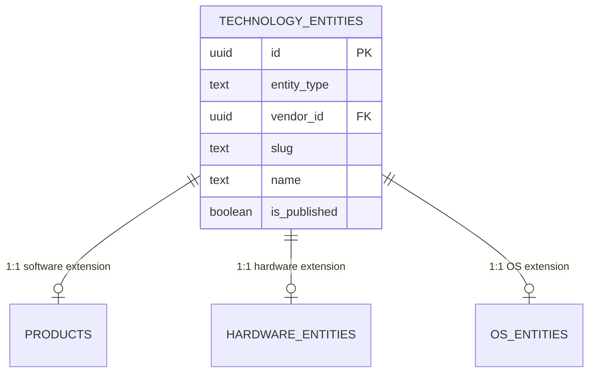
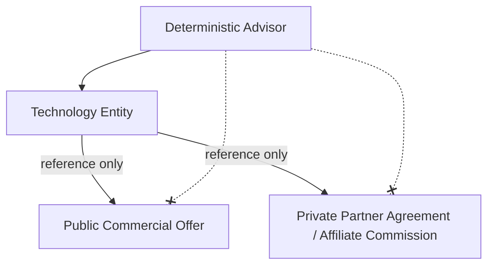

# TECHNAAM PHASE 6C.1 — ARCHITECTURE PROPOSAL

## MISSION
To design the architecture required to expand TechNaam from an AI/developer-tool intelligence foundation into a broader technology intelligence platform, accommodating OpenClaw ingestion scale while preserving the existing recommendation architecture.

---

## SECTION A — CURRENT-SCHEMA ANALYSIS

### 1. Reusable Tables
- **`sources`:** Can be directly reused. Source tracking is fundamental.
- **`vendors` and `categories`:** Directly reusable.
- **`features` and `product_features`:** Can be repurposed or wrapped to support broader technology relationships, but directly reusable for software.
- **`models` and `product_models`:** Directly reusable for AI integration matching.
- **`pricing_plans` and `pricing_history`:** Direct reuse for software subscriptions, but requires extension for effective cost modeling.

### 2. Extensible Tables
- **`evidence` and `change_log`:** Currently use a polymorphic `entity_type` + `entity_id` model. This is flexible but lacks database-level foreign key integrity. They can be safely extended by hooking them into a new `technology_entities` anchor (see Section B) to enforce strong referential integrity.
- **`products`:** Should remain exactly as-is to preserve existing Advisor logic, but will be integrated into the new taxonomy via an additive anchor.

### 3. Unchanged Tables
- **`technaam_scores`:** The deterministic engine remains the authority.
- core Auth and internal tables.

### 4. Constraints Blocking Expansion
- The `products` table conceptually implies software/applications. Attempting to fit a "GPU" or "OS Version" into `products` would overload fields like `website_url` or `status`.
- `hardware_requirements` is too specific (assumes minimum/recommended RAM and specific CPU strings) and doesn't represent hardware as independent entities that can be bought or compared.
- Lack of a structured OS entity (currently just text arrays in seed/requirements).

### 5. Overly Specialized Fields
- In `products`: `first_released_on` and AI-centric assumptions in some seeded features.
- In `hardware_requirements`: Text-based `os`, `cpu`, and `gpu` fields.

### 6. Index/RLS/Public Query Impacts
- Any new anchor table will require strict RLS mirroring the existing `is_published` check from `products`. Existing public views/RPCs (like those feeding the Advisor) will remain unchanged, reading directly from `products` for backward compatibility.

---

## SECTION B — TECHNOLOGY ENTITY MODEL

### Additive Architecture Recommendation
Instead of destructively replacing the `products` table, we propose an **additive anchor model**. We introduce a `technology_entities` table.



- **`technology_entities`** acts as the universal foreign key anchor for all graphs, relationships, and evidence.
- The existing **`products`** table remains unmodified structurally, but we add a nullable `tech_entity_id` foreign key (populated via a migration) to link existing products to the universal graph.

This approach is the least disruptive. Existing code reads `products` exactly as before. Future generalized code queries `technology_entities`.

---

## SECTION C — TAXONOMY DESIGN

To avoid constant migrations, we utilize a combination of base entity types (represented by specific tables) and a structured category taxonomy.

### Entity Types (Tables)
1. `products` (Software, Apps, APIs, AI Services)
2. `hardware_entities` (Laptops, CPUs, GPUs, RAM, Mobile Devices)
3. `os_entities` (Operating Systems, Versions, Editions)

### Categorization (Data-driven)
The existing `categories` table is expanded hierarchically.

```text
Technology Entity (Hardware)
 └── Category: Mobile Device
      └── Vendor: Samsung
           └── Exact Model: Galaxy S24 Ultra
                └── Edition/Variant: 256GB / Titanium

Technology Entity (OS)
 └── Category: Operating System
      └── Vendor: Microsoft
           └── Exact Model: Windows 11
                └── Edition: Pro
```

### Example Taxonomy Schema
```sql
create table public.tech_categories (
    id uuid primary key default gen_random_uuid(),
    parent_id uuid references public.tech_categories(id),
    name text not null,
    slug text not null unique
);
```

---

## SECTION D — TECHNOLOGY GRAPH

A universal relationship model is required to link any two `technology_entities`. To ensure data integrity, the graph must support uniqueness, strict status rules, and relationship-level provenance.

### `tech_relationships`
```sql
create table public.tech_relationships (
    id uuid primary key default gen_random_uuid(),
    source_entity_id uuid not null references public.technology_entities(id),
    target_entity_id uuid not null references public.technology_entities(id),
    relationship_type text not null, -- 'runs_on', 'requires', 'compatible_with', 'depends_on'
    is_symmetric boolean default false,
    version_constraint text, -- e.g., '>= 15.0'
    confidence numeric(4,3) check (confidence >= 0 and confidence <= 1),
    status text not null default 'proposed', -- 'proposed', 'approved', 'rejected', 'conflicted'
    effective_date date,
    expiry_date date,
    evidence_id uuid references public.evidence(id) on delete set null,
    -- Ensure exact identical relationships aren't duplicated
    unique(source_entity_id, target_entity_id, relationship_type)
);

-- Self-referencing check constraint
alter table public.tech_relationships add constraint no_self_reference check (source_entity_id != target_entity_id);
```

### Proposed Relationship Types
- `runs_on`: (App -> OS) Directional. Evidence from official docs.
- `requires`: (App -> Hardware/Software). Hard dependency.
- `compatible_with`: (App -> OS Version). Directional. OpenClaw proposes based on release notes.
- `uses_model`: (App -> AI Model). Directional.
- `powered_by`: (Hardware -> Component). Directional. (e.g., Laptop -> CPU).

---

## SECTION E — OS / VERSION / EDITION MODEL

We separate the OS concept into a dedicated entity table linked to the `technology_entities` anchor.

```sql
create table public.os_entities (
    id uuid primary key default gen_random_uuid(),
    tech_entity_id uuid not null references public.technology_entities(id),
    os_family text not null, -- 'Windows', 'macOS', 'Android'
    version text, -- '11', '15', '14.2'
    edition text, -- 'Pro', 'Home'
    support_status text, -- 'active', 'end_of_life'
    eol_date date
);
```

An application's compatibility is represented in the Technology Graph:
`(App Entity) --[compatible_with]--> (OS Entity: Windows 11)`

---

## SECTION F — HARDWARE MODEL

Hardware components are distinct from the requirement claims made by software.

```sql
create table public.hardware_entities (
    id uuid primary key default gen_random_uuid(),
    tech_entity_id uuid not null references public.technology_entities(id),
    hardware_type text not null, -- 'CPU', 'GPU', 'Laptop', 'RAM'
    architecture text,
    memory_gb numeric,
    vram_gb numeric,
    base_clock_mhz numeric
);
```

A laptop containing components uses the graph:
`(Laptop Entity) --[contains]--> (CPU Entity)`

A software requirement uses the graph:
`(Software Entity) --[requires_hardware]--> (GPU Entity)`

---

## SECTION G — MOBILE MODEL

Mobile devices are a specific taxonomy path under `hardware_entities` and `technology_entities`.

- **Entity Type:** `hardware_entities` where `hardware_type = 'smartphone'`
- **Relationships:**
  - `(iPhone 15 Entity) --[runs_on]--> (iOS 17 Entity)`
  - `(iPhone 15 Entity) --[contains]--> (A16 Bionic CPU Entity)`

---

## SECTION H — EVIDENCE / PROVENANCE

To fix the lack of referential integrity in the current polymorphic model, we migrate `evidence` and `change_log` to reference the universal `technology_entities` anchor.

**Migration must be strictly non-destructive:**
1. **Add:** Create a new `tech_entity_id` column on `evidence`.
2. **Backfill:** Write a script/migration that populates `tech_entity_id` using the current `entity_type` + `entity_id` polymorphic data mapping.
3. **Verify:** Ensure data parity and correctness.
4. **Migrate Consumers:** Update all application queries reading `evidence` to use the new `tech_entity_id`.
5. **Deprecate:** (Future phase) Only remove `entity_type` and `entity_id` columns after a long verification period.

### Upgraded Evidence Model
```sql
alter table public.evidence
  add column tech_entity_id uuid references public.technology_entities(id);
```

**Capabilities Preserved/Added:**
- `source_id`: First-party preference.
- `observed_value`: Raw claim.
- `confidence`: Calculated certainty.
- `review_status`: `pending`, `approved`, `rejected`, `conflicted`.
- `stale_after`: Date when evidence must be re-verified.

---

## SECTION I — COMMERCIAL INTELLIGENCE

Commercial intelligence is strictly isolated. We must strongly separate public commercial *offers* (what users buy) from private commercial *economics* (TechNaam's revenue agreements).



- **Public Offers:** Retails prices, regional availability. Safe to expose via public API if `is_published=true`.
- **Private Economics:** Commission rates, sponsorship payouts, and affiliate agreements. **Must have strict RLS denying public access.** This data never reaches the client browser.

---

## SECTION J — RETAIL PRICE / OFFER MODEL

A separate commercial schema for exact offers:

```sql
create schema if not exists commercial;

-- Public Offers
create table commercial.retail_offers (
    id uuid primary key default gen_random_uuid(),
    tech_entity_id uuid not null references public.technology_entities(id),
    store_id uuid not null references commercial.stores(id),
    region text,
    price_value numeric,
    currency text,
    offer_url text,
    is_public boolean default true -- Exposed for UI deal comparison
);

-- Private Agreements (Strict RLS)
create table commercial.partner_agreements (
    id uuid primary key default gen_random_uuid(),
    vendor_id uuid not null references public.vendors(id),
    commission_rate numeric,
    sponsorship_tier text
    -- RLS: Only Service Role or Internal Admins can select
);
```

---

## SECTION K — EFFECTIVE COST

The future Advisor must calculate cost dynamically, not just read a `pricing_plans` row.

**Proposed Model:**
```text
Cost Profile (Application Layer)
  Base Subscription Plan ($/mo)
+ Expected Usage (Units * Tier Rate)
= Estimated Effective Cost
```
If usage limits are unknown, the system assigns a low `confidence` score to the cost, explicitly rendering "Unknown pricing".

---

## SECTION L — OPENCLAW INGESTION CONTRACT

OpenClaw acts as an API client, not a database administrator.

**Flow:**
1. **DISCOVER/RESEARCH:** OpenClaw finds new facts.
2. **NORMALIZE:** Maps to TechNaam schema.
3. **PROPOSE:** Calls `POST /api/internal/openclaw/proposals`.
4. **RECORD:** API inserts into `evidence` and `tech_relationships` with `review_status = 'pending'`.
5. **HUMAN APPROVAL:** TechNaam owner reviews the UI queue.
6. **PUBLISH:** Approval triggers RPC to set `is_published = true`.

OpenClaw *cannot* execute SQL directly.

---

## SECTION M — OPENCLAW SECURITY & AUTHORITY

Defense in depth is required. OpenClaw must never receive unrestricted `service_role` Supabase access merely for being an automated agent.

1. **Agent Identity:** OpenClaw uses a dedicated JWT with specific custom claims (e.g., `role = 'agent'`, `agent_level = 1`), not the root Service Key.
2. **API Authorization:** The Vercel edge functions inspect the `agent_level` claim. Level 1 agents are structurally blocked by the API from hitting endpoints that mutate `is_published = true`.
3. **Workflow Authorization:** Proposals go into a pending queue. A human must execute the Level 2/3 action.
4. **Database/RLS Authorization:** RLS policies explicitly reject direct mutations to canonical tables unless the JWT is an internal Admin or the application uses its tightly-scoped server action context.

---

## SECTION N — RLS / SECURITY IMPACT

- **Public Data:** Read-only access to `technology_entities` and public `commercial.retail_offers`.
- **Private Data:** RLS strictly denies `SELECT` to public anonymous users for `evidence`, `change_log`, and `commercial.partner_agreements`.
- **Drafts:** RLS `is_published = false` ensures invisibility.

---

## SECTION O — MIGRATION STRATEGY

**Additive Sequence (Non-destructive):**

1. **Migration 1:** Create `technology_entities` table and `tech_categories`.
2. **Migration 2:** Alter `products` to add `tech_entity_id` (nullable).
3. **Migration 3:** Seed script to generate a `technology_entities` row for every existing `products` row.
4. **Migration 4:** Create `tech_relationships` (with strict uniqueness/self-ref constraints), `os_entities`, `hardware_entities`.
5. **Migration 5:** Add `tech_entity_id` to `evidence`. Execute backfill script from polymorphic fields. **Do not drop polymorphic fields yet.**
6. **Migration 6:** Create `commercial` schema. Separate public `retail_offers` from private `partner_agreements`. Apply strict RLS to private economics.

---

## SECTION P — EXISTING FEATURE COMPATIBILITY

- **Tools / Compare:** Continue reading from `products`. The added `tech_entity_id` is ignored by current UI.
- **Advisor / AI:** Unchanged. Reads `products`.

---

## SECTION Q — CURSOR REGRESSION PLAN

Before and after the Phase 6C.1 migration, the test suite must assert:
- `SELECT * FROM products WHERE slug = 'cursor'` returns identical fields.
- The Advisor score for Cursor (given a specific user persona) is identical.
- `evidence` rows for Cursor map correctly to the new `tech_entity_id`.

---

## SECTION R — OPENCLAW SCALE PLAN

1. **Cursor Only:** Baseline verification (Current).
2. **10 Verified (AI Tools):** Tests software-to-software relationships.
3. **20 Verified (Introduce OS/HW):** Add OS and Hardware to test Graph.
4. **50 Verified:** Add complex pricing models.
5. **100+ / Continuous:** Enable auto-discovery.

---

## SECTION S — PERFORMANCE / SCALE

- **Graph Queries:** `tech_relationships` uses bidirectional indexes.

---

## SECTION T — IMPLEMENTATION ORDER

### P0 (Phase 6C.1 Scope)
1. `technology_entities` schema.
2. `tech_relationships` schema with integrity constraints.
3. `os_entities` and `hardware_entities` schema.
4. Add `tech_entity_id` to `evidence` and perform backfill (non-destructive).
5. Update Seed RPC to support the anchor.

### P1 (Phase 6C.2+)
1. Retail offers and commercial isolation schema (public vs private).
2. Store reputation schema.
3. Effective Cost Calculator logic.

**DO NOT IMPLEMENT IN 6C.1:** Retail tables, OpenClaw API endpoints, modifying the Advisor algorithm.

---

## SECTION U — RISKS

- **Migration Risk:** Breaking existing polymorphic `evidence` joins. *Mitigation:* Additive column first, backfill, verify before eventually migrating consumers.
- **Schema Complexity:** Graph loops. *Mitigation:* Limit query depth.
- **Commercial Bias:** Accidental joins. *Mitigation:* Schema separation (`public` vs `commercial`) and strict RLS on economics.

---

## SECTION V — FINAL RECOMMENDATION

**Recommended Architecture:** Additive Anchor Model (`technology_entities` backing `products`, `hardware_entities`, `os_entities`).
**Why:** Achieves universal Technology Graph and strict Evidence referential integrity, without destroying the `products` ecosystem. Strengthens relationship integrity via strict DB constraints and enforces separation of commercial economics (private) from commercial offers (public). Secures OpenClaw via Defense in Depth (JWT Identity -> API Auth -> DB RLS).
**What stays:** `products`, `vendors`, `features`, Advisor Logic, existing RLS.
**What changes:** `evidence` joins (non-destructively backfilled), seed logic adds anchor creation, `tech_relationships` introduced.
**Next Task:** Write the SQL migrations strictly adhering to the P0 sequence and non-destructive backfill rules, alongside regression tests. Do not execute or push until Owner approval.
